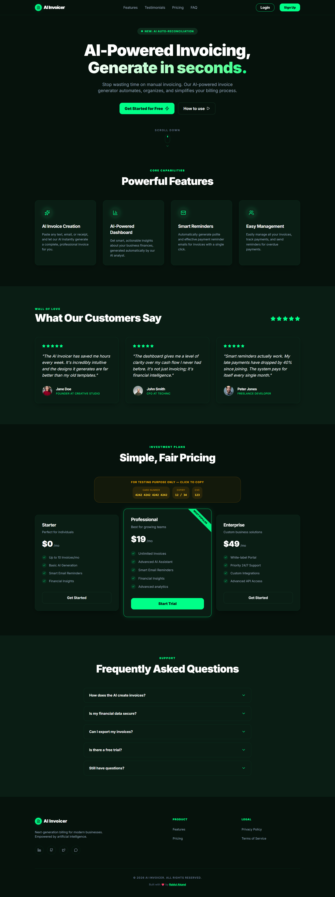

<div align="center">
  

# 🤖 AI Invoicer

**AI-Powered Invoicing. Generate, Organize, and Send in seconds.**

**Live URL:** [https://ai-invoicer-rabiul.vercel.app](https://ai-invoicer-rabiul.vercel.app)

[](https://ai-invoicer-rabiul.vercel.app)
[](https://github.com/rabiul7772/ai-invoicer)

</div>

---

- App Live URL: [AI Invoicer](https://ai-invoicer-rabiul.vercel.app)

## 📖 Project Overview

**AI Invoicer** is a modern, full-stack web application designed to eliminate the manual hassle of creating and managing invoices. By leveraging the power of Google's Gemini AI model, users can generate complete, professional invoices simply by typing a natural language prompt.

The application offers a fully featured dashboard to organize clients, track payment statuses, visualize business insights, and send beautifully formatted PDF invoices directly to clients via email.

---

## ✨ Key Features

- **🧠 Create with AI:** Type a prompt like _"Invoice John Doe $500 for web design services last week"_ and let Gemini automatically extract line items, prices, and client details into a perfect invoice.
- **📊 Business Dashboard:** Get AI-driven insights on your collection efficiency, client reliability, and overdue risks directly on your dashboard.
- **✉️ Automated Emails:** Send invoices with attached PDFs directly to clients via the Brevo API integration.
- **💳 Stripe Subscription:** Implement scalable tier-based access control with Stripe Checkout and Webhooks (Starter & Professional plans).
- **🔒 Secure Authentication:** JWT-based user authentication and route protection.
- **💅 Beautiful UI/X:** Built with Tailwind CSS, Framer Motion animations, and a glowing neon aesthetic for a premium feel.

---

## 🛠 Tech Stack

| Category           | Technologies Used                                                                                                   |
| ------------------ | ------------------------------------------------------------------------------------------------------------------- |
| **Frontend**       | React 19, TypeScript, Vite, Tailwind CSS, Framer Motion, React Router v7, React Hook Form, Zod, Lucide React, Axios |
| **Backend**        | Node.js, Express, TypeScript, Mongoose                                                                              |
| **Database**       | MongoDB (hosted on MongoDB Atlas)                                                                                   |
| **AI Integration** | Google Gemini AI (`@google/genai`)                                                                                  |
| **Authentication** | JSON Web Tokens (JWT)                                                                                               |
| **Payments**       | Stripe API & Webhooks                                                                                               |
| **Email Service**  | Brevo API (`@getbrevo/brevo`)                                                                                       |
| **Image Storage**  | Cloudinary                                                                                                          |
| **PDF Generation** | Puppeteer                                                                                                           |
| **App Security**   | Arcjet (Bot/Rate-Limit protection)                                                                                  |

---

## 📁 Folder Structure

```text
ai-invoicer/
├── backend/                  # Express.js REST API
│   ├── src/
│   │   ├── config/           # Database & Env configurations
│   │   ├── controllers/      # API Route logic (Auth, Invoices, Stripe, AI)
│   │   ├── middleware/       # JWT Auth, Error handling, Arcjet security
│   │   ├── models/           # Mongoose schemas
│   │   ├── routes/           # Express routers
│   │   └── utils/            # PDF generation, Email templates, Brevo service
│   └── package.json
│
└── frontend/                 # React SPA
    ├── public/               # Static assets & banner images
    ├── src/
    │   ├── animations/       # Framer Motion variants
    │   ├── components/       # Reusable UI components & Sections
    │   ├── features/         # Domain-driven features (Auth, Invoices, AI)
    │   ├── pages/            # React Router page components
    │   └── lib/              # Axios instances & utility functions
    └── package.json
```

---

## 🚀 Installation & Setup Guide

### Prerequisites

Make sure you have [Node.js](https://nodejs.org/) and [Git](https://git-scm.com/) installed on your machine. You will also need active accounts for MongoDB Atlas, Google Gemini API, Stripe, and Brevo.

### 1. Clone the Repository

```bash
git clone https://github.com/rabiul7772/ai-invoicer.git
cd ai-invoicer
```

### 2. Backend Setup

```bash
cd backend
npm install
```

Create a `.env` file in the `backend` directory based on `.env.example`:

```env
PORT=5000
MONGODB_URI=your_mongo_db_connection_string
JWT_SECRET=your_super_secret_jwt_key
FRONTEND_URL=http://localhost:5173

# AI & Security
GEMINI_API_KEY=your_google_gemini_api_key
GEMINI_MODEL=gemini-3.1-flash-lite-preview
ARCJET_KEY=your_arcjet_key
ARCJET_ENV=development

# Email Delivery (Brevo)
BREVO_API_KEY=your_brevo_api_key
SMTP_USER=your_sender_email_address

# Stripe
STRIPE_SECRET_KEY=your_stripe_secret_key
STRIPE_WEBHOOK_SECRET=your_stripe_webhook_signing_secret
```

### 3. Frontend Setup

Open a new terminal window:

```bash
cd frontend
npm install
```

Create a `.env` file in the `frontend` directory:

```env
VITE_API_URL=http://localhost:5000/api/v1
```

### 4. Run the Application

Start both development servers.

**Run Backend:**

```bash
cd backend
npm run dev
```

**Run Frontend:**

```bash
cd frontend
npm run dev
```

The app will be available at `http://localhost:5173`.

---

## 👨‍💻 Author

**Rabiul Akand**

- GitHub: [@rabiul7772](https://github.com/rabiul7772)
- LinkedIn: [@rabiul7772](https://www.linkedin.com/in/rabiul-akand)

Built with ❤️ for better invoicing management.
